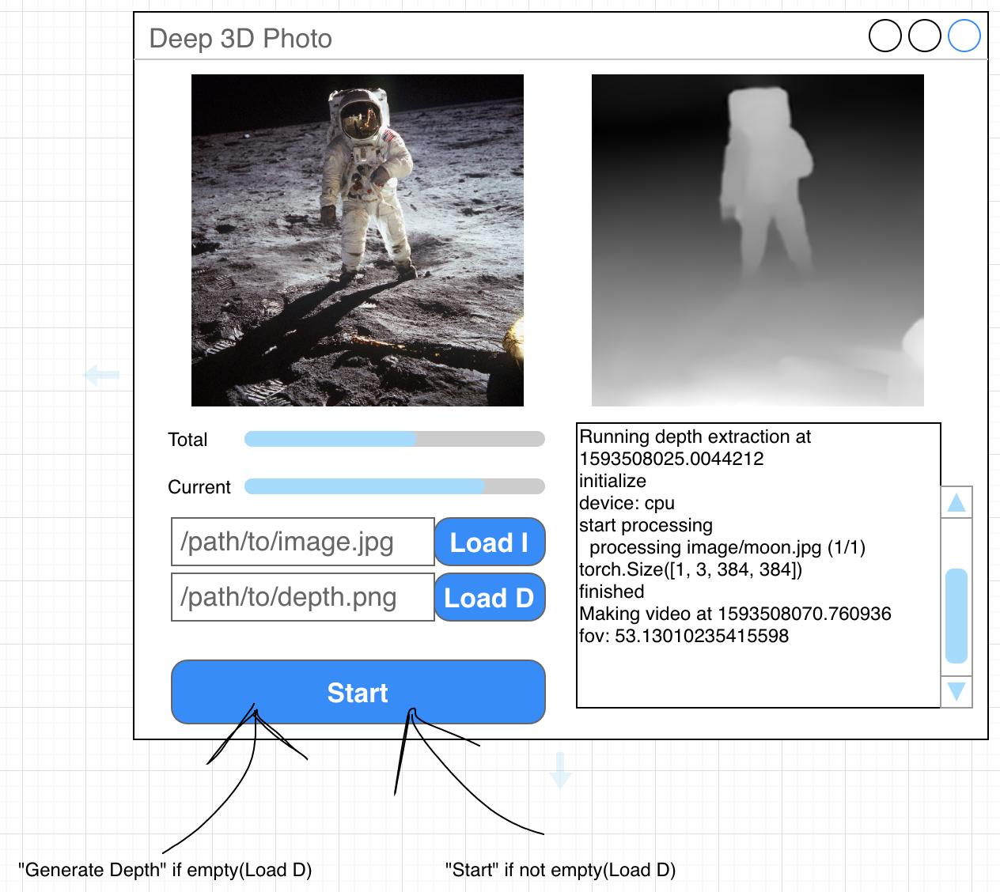

# deep_3d_photo
A Kivy GUI for Deeplearning 3d-photo-inpainting

## Draft

## Create an installer (Windows)

The following steps require a Windows machine.

### Build

Just run the `build_tools\build.bat` script. What it does:

* Creates folder `winbuild`.
* within `winbuild\deep_3d_photo` gets a git clone of the `windows_build` branch.
* within `winbuild\deep_3d_photo\bootstrap` a working minimal version of Python 3.8 (virtualenv).
  This will be used to initialize the python environment on the user machine. This is not the environment
  that will end up being used, as they are no relocatable. Instead, a new one will be created at installation
  time, by using the material of that one that comes with `pipenv` installed.
* copies `build_tools\START.bat` to `winbuild\START.bat`.
* removes unneeded files (git, examples, build tools, ...).

### Distribute

Just run the `build_tools\dist.bat` script. What it does:

* Creates folder `windist`.
* Determines the software version (but no longer used). Todo: inject into the Installation Compiler.
* Runs embedded Inno Setup Compiler, from `build_tools\inno` using prepared `build_tools\inno_script.iss`.
* Installer will be located in `windist`.

### Install on user machine

* Double click on the installer `.exe` file and follow the instructions.
* The last step will create the new Python 3.8 virtual environment and install all the dependencies.
  The choice to have an online installer was to reduce the installer size from 2+GB to 15MB.
